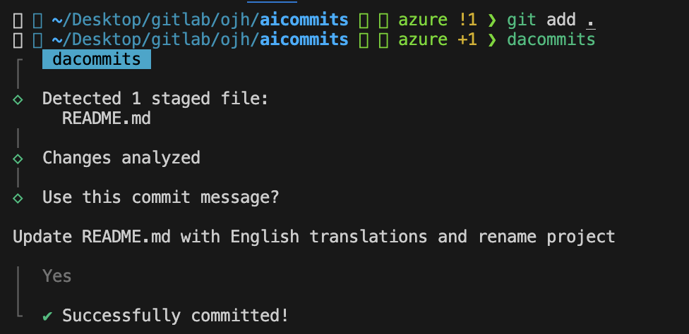

<div align="center">
  <div>
    
    <h1 align="center">DA Commits</h1>
  </div>
	<p>AI 도우미 "dacommits"! 커밋 메시지 작성은 이제 그만! </p>
   <p>AI를 통해 자동으로 편리하게 완성해드립니다. 😎🚀</p>
</div>

---

## Setup

> Node.js 버전 14이상 부터 지원합니다. `node --version` 으로 버전을 확인하세요.
> The minimum supported version of Node.js is the latest v14. Check your Node.js version with `node --version`.

1. dacommits 설치 방법 (Install _dacommits_):

   ```sh
   npm install -g dacommits
   ```

2. 키 발급 방법 (Retrieve your API key):

   > Note: API Key가 없으시다면, **Data 혁신 조직**을 통해 API 키를 발급 받습니다.

3. API 키 세팅 방법 (Set the key so dacommits can use it):

   ```sh
   dacommits config set OPENAI_KEY=<your token>
   ```

   > 본인 컴퓨터 `.dacommits` 에 env로 등록됩니다.
   > This will create a `.dacommits` file in your home directory.

### Upgrading (TODO 작성 중)

Check the installed version with:

```
dacommits --version
```

## 사용방법 (Usage)

### 명령어 모드 (CLI mode)

`dacommit` 명령어를 통해 staged에 올라온 변경사항들을 자동으로 커밋 메세지를 작성할 수 있습니다.
You can call `dacommits` directly to generate a commit message for your staged changes:

```sh
git add <files...>
dacommits
```

`dacommits` passes down unknown flags to `git commit`, so you can pass in [`commit` flags](https://git-scm.com/docs/git-commit).

---

추적되고 있는 파일들을 모두 stage에 올려서 실행해보고 싶다면, 아래와 같은 명령어를 입력 해보세요.
For example, you can stage all changes in tracked files with as you commit:

```sh
dacommits --all # or -a
```

> 👉 **팁:** `dacommits` 대신 `dac` 명령어로 대신 사용할 수 있어요.
> 👉 **Tip:** Use the `dac` alias if `dacommits` is too long for you.

#### Generate multiple recommendations

가끔 추천된 커밋 메시지가 최적이 아닐 수 있으므로 여러 옵션 중에서 선택하고 싶을 때가 있습니다.
`--generate <i>` 플래그를 전달하여 한 번에 여러 개의 커밋 메시지를 생성할 수 있어요.
`여기서 'i'는 생성할 메시지의 수`

Sometimes the recommended commit message isn't the best so you want it to generate a few to pick from. You can generate multiple commit messages at once by passing in the `--generate <i>` flag, where 'i' is the number of generated messages:

```sh
dacommits --generate <i> # or -g <i>
```

> Warning: 생성되는 수에 비례하여 과금이 됩니다...

#### Convential Commit 생성 방법

#### Generating Conventional Commits

Conventional Commits를 생성하려면 --type 플래그를 사용한 후에 conventional을 입력하세요. 이렇게 하면 `dacommits`가 Conventional Commits 규격에 따라 커밋 메시지를 자동으로 형식화 해줍니다.

If you'd like to generate [Conventional Commits](https://conventionalcommits.org/), you can use the `--type` flag followed by `conventional`. This will prompt `dacommits` to format the commit message according to the Conventional Commits specification:

```sh
dacommits --type conventional # or -t conventional
```

### 깃 훅 (Git hook)

`dacommits`를 Git과 통합하려면 prepare-commit-msg 후크를 사용할 수 있습니다.
이렇게 하면 일반적인 방식으로 Git을 사용하면서 커밋하기 전에 커밋 메시지를 편집할 수 있습니다.

You can also integrate _dacommits_ with Git via the [`prepare-commit-msg`](https://git-scm.com/docs/githooks#_prepare_commit_msg) hook. This lets you use Git like you normally would, and edit the commit message before committing.

#### 설치 (Install)

In the Git repository you want to install the hook in:

```sh
dacommits hook install
```

#### 제거 (Uninstall)

In the Git repository you want to uninstall the hook from:

```sh
dacommits hook uninstall
```

#### 사용 (Usage)

1. Staged된 파일과 커밋 (Stage your files and commit):

   ```sh
   git add <files...>
   git commit # Only generates a message when it's not passed in
   ```

   > dacommits이 생성하지 않고 수동으로 commit message를 작성하고 싶다면 다음과 같은 명령어를 작성해보세요. `git commit -m "My message"`

   > If you ever want to write your own message instead of generating one, you can simply pass one in: `git commit -m "My message"`

2. dacommits는 커밋 메시지를 생성하여 Git에 다시 전달합니다. Git은 해당 메시지를 여러분이 설정한 편집기로 열어 여러분이 검토하고 편집할 수 있도록 합니다.
   [configured editor](https://docs.github.com/en/get-started/getting-started-with-git/associating-text-editors-with-git)

3. Save and close the editor to commit!

## Configuration (설정)

### Reading a configuration value

#### Config 가져오기

To retrieve a configuration option, use the command:

```sh
dacommits config get <key>
```

For example, to retrieve the API key, you can use:

```sh
dacommits config get OPENAI_KEY
```

You can also retrieve multiple configuration options at once by separating them with spaces:

```sh
dacommits config get OPENAI_KEY generate
```

### Setting a configuration value

#### Config 설정하기

To set a configuration option, use the command:

```sh
dacommits config set <key>=<value>
```

For example, to set the API key, you can use:

```sh
dacommits config set OPENAI_KEY=<your-api-key>
```

You can also set multiple configuration options at once by separating them with spaces, like

```sh
dacommits config set OPENAI_KEY=<your-api-key> generate=3 locale=en
```

### 옵션 (Options)

#### OPENAI_KEY

Required

The OpenAI API key. You can retrieve it from [OpenAI API Keys page](https://platform.openai.com/account/api-keys).

#### locale

Default: `en`

The locale to use for the generated commit messages. Consult the list of codes in: https://wikipedia.org/wiki/List_of_ISO_639-1_codes.

#### generate

Default: `1`

The number of commit messages to generate to pick from.

Note, this will use more tokens as it generates more results.

#### proxy

Set a HTTP/HTTPS proxy to use for requests.

To clear the proxy option, you can use the command (note the empty value after the equals sign):

```sh
dacommits config set proxy=
```

#### model

Default: `gpt-3.5-turbo`

#### timeout

The timeout for network requests to the OpenAI API in milliseconds.

Default: `10000` (10 seconds)

```sh
dacommits config set timeout=20000 # 20s
```

#### max-length

The maximum character length of the generated commit message.

Default: `50`

```sh
dacommits config set max-length=100
```

#### type

Default: `""` (Empty string)

The type of commit message to generate. Set this to "conventional" to generate commit messages that follow the Conventional Commits specification:

```sh
dacommits config set type=conventional
```

You can clear this option by setting it to an empty string:

```sh
dacommits config set type=
```

## How it works (어떻게 작동 하나요?)

This CLI tool runs `git diff` to grab all your latest code changes, sends them to OpenAI's GPT-3, then returns the AI generated commit message.

이 CLI 도구는 git diff를 실행하여 최신 코드 변경 사항을 모두 가져오고, 이를 OpenAI의 GPT로 전송한 다음, 생성된 AI 커밋 메시지를 반환합니다.

## Maintainers

- Data 혁신 Data Adoption팀 오종해

## 아래 OpenSource 참고하여 만들어짐.

If you want to help fix a bug or implement a feature in [Issues](https://github.com/Nutlope/dacommits/issues), checkout the [Contribution Guide](CONTRIBUTING.md) to learn how to setup and test the project.
